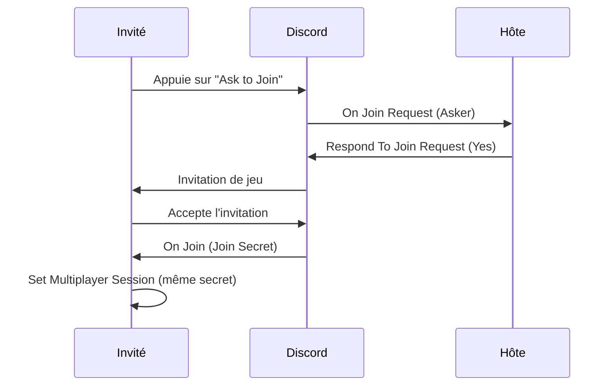

<div align="center">

<!-- PLACEHOLDER : ton logo ici, 200px de large rend le mieux -->


# Even Richer Discord Presence

**Le plugin Discord Rich Presence complet pour Unreal Engine.**
*Zéro dépendance. Source C++ complète. Pensé pour Blueprint.*

[]()
[](https://www.fab.com/sellers/Kybrien)
[](https://discord.gg/BwhyxQAAUn)

[English documentation](README.md) · **Français**

[Installation](#-installation) · [Démarrage rapide](#-démarrage-rapide) · [Référence des nœuds](#-référence-des-nœuds) · [Recettes](#-recettes) · [Dépannage](#-dépannage)

</div>

---

<!-- PLACEHOLDER : capture principale, une vraie carte de présence Discord -->


## Pourquoi ce plugin

|  | Even Richer Discord Presence | Alternatives gratuites |
|---|:---:|:---:|
| **Aucune DLL embarquée** | Oui | Non, embarque `discord-rpc` |
| **Activement maintenu** | Oui | Abandonné |
| **Boutons de profil** | Oui | Non |
| **Types d'activité** | Oui | Non |
| **Décompte et barre de progression** | Oui | Non |
| **Diagnostics exploitables** | Oui | Non |
| **Source C++ complète** | Oui | Variable |

> Les alternatives gratuites encapsulent `discord-rpc`, une bibliothèque **abandonnée par Discord
> lui-même**, et embarquent une DLL précompilée dans ton jeu. Ce plugin parle directement le protocole
> IPC de Discord, en C++ natif moteur.

---

## 📦 Installation

### 1. Installer le plugin

Copie le dossier `EvenRicherDiscordPresence` dans le dossier `Plugins/` de ton projet, relance
l'éditeur et accepte la compilation.

Vérifie dans **Edit → Plugins** que *Even Richer Discord Presence* est bien activé.

### 2. Créer ton application Discord

> [!IMPORTANT]
> **Le nom de l'application est ce que voient les joueurs.** Si tu l'appelles `Test`, Discord affichera
> *« Joue à Test »*. Mets directement le nom commercial de ton jeu.

1. Va sur le [portail développeur Discord](https://discord.com/developers/applications) → **New Application**
2. Ouvre **General Information** et copie l'**Application ID**

<!-- PLACEHOLDER : capture du portail avec l'Application ID entouré -->


### 3. Uploader tes images

> [!WARNING]
> Les images **doivent** aller dans **Rich Presence → Art Assets**, et *pas* dans **Cover Image**.
> Une Cover Image n'a pas de nom, elle ne peut donc jamais servir de clé d'image. C'est de loin
> l'erreur d'installation la plus fréquente.

1. Dans ton application, ouvre **Rich Presence → Art Assets**
2. Clique sur **Add Image(s)** et uploade tes visuels
3. Le **nom** que tu donnes à chaque asset est ce que tu mettras dans `Large Image Key`

<!-- PLACEHOLDER : capture de l'onglet Art Assets avec un nom d'asset entouré -->


**Dimensions :** carré, 512x512 minimum. La grande image est rendue en carré, donc un visuel 16:9 sera
rogné.

**Propagation :** compte jusqu'à 10 minutes, puis fais `Ctrl+R` dans Discord. Les clés d'image
acceptent aussi une URL `https://` directe, qui fonctionne instantanément et rend service pour tester.

### 4. Configurer le plugin

**Edit → Project Settings → Plugins → Even Richer Discord Presence**

| Réglage | Défaut | Rôle |
|---|:---:|---|
| **Client Id** | *vide* | Ton Application ID Discord. **Obligatoire.** |
| **Auto Connect On Startup** | ✅ | Se connecte au lancement. Décoché, la connexion s'ouvre au premier appel de présence. |
| **Auto Subscribe To Activity Events** | ✅ | S'abonne automatiquement à Join et Ask to Join. |

<!-- PLACEHOLDER : capture du panneau Project Settings -->


### 5. Activer l'affichage de l'activité dans Discord

> [!CAUTION]
> Dans le **client Discord**, pas dans le portail :
> **Paramètres utilisateur → Confidentialité de l'activité → Afficher l'activité en cours** doit être
> **activé**.
>
> C'est un réglage *par joueur*. Aucun code ne peut le contourner, et c'est la cause numéro un du
> *« rien ne s'affiche »*.

---

## 🚀 Démarrage rapide

Place ceci dans ton **Game Instance Blueprint**. Il survit aux changements de niveau, donc la présence
ne se coupe pas pendant un chargement.

```
Event Init
  └─ Discord ──► Set Presence
                   Details            : "Ashfall Ridge"
                   State              : "Exploration"
                   Large Image Key    : "cover"
                   Large Image Text   : "Ashfall Ridge"
                   Show Elapsed Timer : ✔
```

Tape **`discord`** dans la recherche Blueprint pour trouver le nœud compact **Discord**, puis tire
depuis sa sortie pour atteindre tout le reste.

**C'est toute l'intégration.** Aucun câblage de Game Instance, aucun cast, aucun tick, aucun appel
manuel de callbacks.

<!-- PLACEHOLDER : capture de ce graphe Blueprint exact -->


**Résultat :**

```
Joue à YourAppName
Ashfall Ridge          ← Details
Exploration            ← State
02:14 écoulées         ← Show Elapsed Timer
[image]                ← Large Image Key
```

---

## 🧩 Référence des nœuds

**20 nœuds Blueprint, 6 events.** Chacun porte une infobulle dans l'éditeur.

*Les noms de nœuds, de pins et de champs restent en anglais, puisque c'est ainsi qu'ils apparaissent
dans Unreal.*

### Point d'entrée

| Nœud | Description |
|---|---|
| **Discord** *(Get Discord Presence)* | Nœud pur compact. Le point d'entrée unique, tire dessus pour atteindre tout le reste. |

<br/>

### Présence

<table>
<tr><th>Nœud</th><th>Ce qu'il fait</th></tr>
<tr><td><b>Set Presence</b></td><td>Le nœud principal. Définit ce qui s'affiche sur le profil.</td></tr>
<tr><td><b>Restart Elapsed Timer</b></td><td>Remet le chronomètre à zéro et republie immédiatement.</td></tr>
<tr><td><b>Clear Presence</b></td><td>Retire la présence sans fermer la connexion.</td></tr>
<tr><td><b>Set Advanced Presence</b></td><td>Prend la structure <code>Discord Activity</code> complète.</td></tr>
</table>

<details>
<summary><b>▸ Set Presence, les 11 pins</b></summary>

<br/>

| Pin | Type | Visible par défaut | Rôle |
|---|---|:---:|---|
| `Details` | String | ✅ | Première ligne. Le niveau, le mode ou le match. |
| `State` | String | ✅ | Deuxième ligne. Ce que le joueur fait maintenant. |
| `Large Image Key` | String | ✅ | Nom de l'asset, ou une URL `https://`. |
| `Large Image Text` | String | ✅ | Infobulle au survol de la grande image. |
| `Show Elapsed Timer` | Bool | ✅ | Chronomètre croissant. |
| `Activity Type` | Enum | *replié* | Playing / Listening to / Watching / Competing in. |
| `Status Display Type` | Enum | *replié* | Quelle ligne apparaît dans la liste des membres. |
| `Countdown Seconds` | Int | *replié* | Décompte. `0` le désactive. |
| `Small Image Key` | String | *replié* | Image de coin. |
| `Small Image Text` | String | *replié* | Infobulle de la petite image. |
| `Buttons` | Array | *replié* | Jusqu'à 2 boutons cliquables sur le profil. |

*Les pins repliées se trouvent derrière la petite flèche en bas du nœud. Repliée signifie masquée sur
ce nœud, **pas** « disponible uniquement sur Set Advanced Presence ».*

</details>

<details>
<summary><b>▸ Les chronomètres, trois modes</b></summary>

<br/>

Les deux pins de chronomètre sont indépendantes, et c'est leur **combinaison** qui débloque le mode le
plus intéressant.

| `Show Elapsed Timer` | `Countdown Seconds` | Discord affiche |
|:---:|:---:|---|
| ✅ | `0` | Un chronomètre **croissant**. Le rendu « durée de session ». |
| ❌ | `60` | Un **décompte** jusqu'à zéro. |
| ✅ | `60` | Une **barre de progression** avec écoulé et restant, comme un lecteur de musique. |

`Countdown Seconds` ne redémarre que si la valeur demandée *change*, donc appeler `Set Presence` à
chaque frame avec la même durée garde une échéance stable.

> [!NOTE]
> **Un décompte terminé ne disparaît pas.** Une fois l'échéance passée, Discord bascule l'affichage et
> compte **en montant** depuis ce point. Un timer de round qui atteint zéro devient silencieusement un
> compteur de prolongation. Pousse une nouvelle valeur ou remets `0`.

</details>

<details>
<summary><b>▸ Set Advanced Presence, et quand l'utiliser</b></summary>

<br/>

Ce **n'est pas** « Set Presence avec plus d'options débloquées ». Exactement quatre champs ne sont
accessibles que par ce nœud :

| Champ | Pourquoi il n'est pas sur Set Presence |
|---|---|
| `Start Timestamp` | `Show Elapsed Timer` le fait déjà correctement. |
| `End Timestamp` | `Countdown Seconds` le fait déjà correctement. |
| `Details Url` | Cas de niche, ajouterait une pin que la plupart des projets ne touchent jamais. |
| `State Url` | Idem, et ne s'affiche que sans party. |

L'autre raison de l'utiliser : la structure est **stockable**. Des presets de présence peuvent vivre
dans une Data Table et circuler entre fonctions, c'est le seul chemin data driven du plugin.

La dérivation du party ID, la préservation de session et tous les diagnostics s'appliquent ici
exactement comme sur `Set Presence`.

</details>

<br/>

### Multijoueur

<table>
<tr><th>Nœud</th><th>Ce qu'il fait</th></tr>
<tr><td><b>Set Multiplayer Session</b></td><td>Rend la session joignable. Fusionne dans la présence déjà en place.</td></tr>
<tr><td><b>Clear Multiplayer Session</b></td><td>Retire la party et le secret. Le seul moyen de terminer une session.</td></tr>
<tr><td><b>Respond To Join Request</b></td><td>Répond à un Ask to Join par Yes, No ou Ignore.</td></tr>
<tr><td><b>Subscribe To Activity Event</b> <i>(avancé)</i></td><td>Abonnement manuel. Utile seulement si Auto Subscribe est désactivé.</td></tr>
<tr><td><b>Unsubscribe From Activity Event</b> <i>(avancé)</i></td><td>L'inverse.</td></tr>
<tr><td><b>Is Subscribed To Activity Event</b> <i>(avancé)</i></td><td>Renvoie un booléen.</td></tr>
</table>

<details>
<summary><b>▸ Set Multiplayer Session, les 5 pins</b></summary>

<br/>

| Pin | Type | Visible par défaut | Rôle |
|---|---|:---:|---|
| `Join Secret` | String | ✅ | Le jeton que Discord te rend via `On Join`. C'est lui qui fait apparaître **Ask to Join**. |
| `Party Size` | Int | ✅ | Nombre de joueurs actuel. |
| `Party Max` | Int | ✅ | Capacité du groupe. |
| `Party Id` | String | *replié* | Laisse vide, il est dérivé du join secret. Obligatoire côté Discord pour qu'une party s'affiche. |

</details>

<br/>

### Connexion

| Nœud | Renvoie | Ce qu'il fait |
|---|:---:|---|
| **Connect** | | Se connecte avec un Client ID donné. Utile pour surcharger celui des settings ou choisir le moment. |
| **Disconnect** | | Ferme la connexion et efface la présence. |
| **Is Connected** | `Bool` | Vrai une fois le handshake terminé. |
| **Get Connection State** | `Enum` | `Disconnected` / `Connecting` / `Connected`. |
| **Get Local User** | `Struct` | Le compte Discord connecté sur cette machine. Mis en cache pour toute la session. |

<br/>

### Utilitaires

| Nœud | Renvoie | Ce qu'il fait |
|---|:---:|---|
| **Now** *(Discord Time Now)* | `Int64` | Timestamp Unix actuel. À brancher sur `Start Timestamp`. |
| **Discord Time From Now** | `Int64` | Un timestamp Unix futur. À brancher sur `End Timestamp`. |
| **Button** *(Discord Button)* | `Struct` | Construit un bouton de profil à partir d'un label et d'une URL. |
| **Get Discord Avatar URL** | `String` | Une URL d'image directe, prête pour un brush UMG. |

*`Get Discord Avatar URL` gère les avatars animés (`.gif`), arrondit la taille à la puissance de deux
la plus proche (16 à 4096), et retombe sur l'avatar par défaut si besoin.*

---

## 📡 Events

**Les six se déclenchent sur le game thread**, donc acteurs, widgets et game state sont manipulables
directement.

| Event | Données | Se déclenche quand |
|---|---|---|
| **On Ready** | `Local User` | Le handshake est terminé. |
| **On Connection Error** | `Code`, `Message` | Discord refuse ou est injoignable. |
| **On Disconnected** | | La connexion est perdue ou fermée. |
| **On Connection State Changed** | `New State` | À chaque changement d'état. |
| **On Join** | `Join Secret` | Le joueur a accepté une invitation. |
| **On Join Request** | `Asker` | Quelqu'un a appuyé sur Ask to Join. |

> [!IMPORTANT]
> **`On Ready` peut se déclencher avant que ton Blueprint ne s'y abonne.** La connexion démarre dès
> l'initialisation du subsystem et le handshake revient sur un thread worker. Abonne-toi **et** vérifie
> l'état courant au même endroit :
>
> ```
> Discord ──► Bind Event to On Ready ──► HandleReady
> Discord ──► Is Connected ─► Branch ─► True ──► HandleReady
> ```
>
> C'est pour ça que ça semble aléatoire : un pipe froid est assez lent pour que tu gagnes la course, un
> pipe chaud non.

*Ces six events sont l'ensemble complet. Discord lui-même n'émet que deux events entrants pour le Rich
Presence, join et join request, donc il n'existe ni event de départ, ni mise à jour de party, ni liste
de membres.*

---

## 🧱 Structures et énumérations

<details>
<summary><b>▸ Discord Activity</b></summary>

<br/>

| Champ | Accessible depuis |
|---|---|
| `Activity Type` | Set Presence |
| `Status Display Type` | Set Presence |
| `State` / `Details` | Set Presence |
| `Details Url` / `State Url` | Set Advanced Presence uniquement |
| `Start Timestamp` / `End Timestamp` | Set Advanced Presence uniquement |
| `Large Image Key` / `Text` | Set Presence |
| `Small Image Key` / `Text` | Set Presence |
| `Party Id` / `Size` / `Max` | Set Multiplayer Session |
| `Buttons` | Set Presence |
| `Join Secret` | Set Multiplayer Session |

*Deux champs du protocole, `Match Secret` et `Instance`, existent dans la structure mais ne sont
**pas exposés en Blueprint**. Ils pilotaient l'ancien bouton « Notify me » que Discord n'affiche plus.
Ils restent sérialisés et modifiables depuis le C++ pour la parité complète avec le protocole.*

</details>

<details>
<summary><b>▸ Discord Activity Type</b></summary>

<br/>

| Valeur | Affiche | Convient à |
|---|---|---|
| **Playing** *(défaut)* | Joue à *TonJeu* | Presque tous les jeux |
| **Listening to** | Écoute *TonJeu* | Musique, audio *(pas de party, pas de join)* |
| **Watching** | Regarde *TonJeu* | Vidéo, replays *(pas de party, pas de join)* |
| **Competing in** | Participe à *TonJeu* | Classé, tournois *(pas de party, pas de join)* |

> [!WARNING]
> **Toute la partie multijoueur exige `Playing`.** Discord accepte un join secret et une party sur
> n'importe quel type et les renvoie tels quels, mais il n'affiche ni le compteur de party ni le bouton
> Ask to Join si le type n'est pas Playing. Les boutons de profil, eux, s'affichent sur les quatre
> types.

*Discord n'accepte que ces quatre types en Rich Presence. Streaming et Custom sont refusés par le
client Discord lui-même, ils sont donc volontairement absents plutôt qu'offerts et ignorés en
silence.*

</details>

<details>
<summary><b>▸ Discord Status Display Type</b></summary>

<br/>

Choisit quelle ligne unique Discord utilise pour le **statut affiché à côté du pseudo**, dans la liste
des membres d'un serveur et dans la liste d'amis.

| Valeur | La liste des membres affiche |
|---|---|
| **Game Name** *(défaut)* | `Joue à TonJeu` |
| **State Line** | ton texte `State` |
| **Details Line** | ton texte `Details` |

> [!NOTE]
> **Ça ne change pas la carte de profil.** La carte affiche toujours toutes les lignes que tu as
> définies. Changer ce réglage en regardant un profil ne montre aucune différence, ce qui donne
> facilement l'impression que c'est cassé. Regarde plutôt la liste des membres d'un serveur, idéalement
> depuis un second compte.

</details>

<details>
<summary><b>▸ Autres types</b></summary>

<br/>

- **Discord Activity Button :** `Label`, `Url`. Maximum 2 par activité.
- **Discord User** *(lecture seule)* : `User Id`, `Username`, `Global Name`, `Avatar`.
- **Discord Connection State :** `Disconnected` / `Connecting` / `Connected`.
- **Discord Join Reply :** `No` / `Yes` / `Ignore`.

</details>

---

## 🎮 Guide multijoueur

### Les deux emplacements de bouton

Une carte de présence Discord a de la place pour **exactement deux boutons**, et il existe deux façons
complètement différentes de les remplir. Discord ne les mélange pas.

<table>
<tr>
<td width="50%" valign="top">

**Voie 1 : boutons de profil**
*Tu les définis*

Remplis via la pin `Buttons`. Ce sont des liens externes, un clic ouvre un navigateur et rien ne
revient vers ton jeu.

```
Button "Rejoins le Discord"  https://discord.gg/xxx
Button "Wishlist sur Steam"  https://store.steam...
```

Typique pour un jeu solo ou une présence marketing.

</td>
<td width="50%" valign="top">

**Voie 2 : boutons de session**
*Discord les génère*

Tu ne les nommes jamais. **Ask to Join** apparaît parce qu'un `Join Secret` existe.

Interactif : un clic déclenche un aller-retour avec ton jeu, et le secret te revient pour que tu
connectes le joueur.

C'est le seul chemin qui produit du gameplay.

</td>
</tr>
</table>

> [!CAUTION]
> **Pour un jeu multijoueur, laisse la pin `Buttons` vide.** Un seul fil branché par erreur dans cette
> pin coûte silencieusement la joignabilité à chaque rafraîchissement de texte. C'est la façon la plus
> fréquente de casser un flow de join qui fonctionnait, pendant que tout le reste semble normal.

**Deux comportements qui ressemblent à des bugs et n'en sont pas :**

- **Tu ne verras jamais ces boutons sur ton propre profil.** Discord ne les affiche qu'aux autres.
- **Une party pleine ne masque pas forcément Ask to Join.** Applique la capacité côté jeu.

### La chaîne complète du join



> [!IMPORTANT]
> **Discord ne gère aucune appartenance à un groupe.** Accepter une invitation lance le jeu et
> transmet le secret à `On Join`. Discord n'ajoute personne à une party et ne modifie **jamais** la
> présence du joueur qui rejoint.
>
> Le regroupement se produit uniquement parce que deux clients publient indépendamment le **même join
> secret** et dérivent donc le même party ID. Si le jeu du joueur qui rejoint n'appelle jamais
> `Set Multiplayer Session`, il affichera le jeu sans aucun groupe, ce qui semble cassé sans l'être.

### Garder le compteur de party juste

`Party Size` est une valeur **publiée par ton jeu**, pas un compteur maintenu par Discord.

Chaque machine déjà dans la session doit republier quand le compte change. Si un second joueur rejoint
et que seul le nouveau venu publie `Party Size 2`, l'hôte reste à `1 sur 4` alors qu'ils sont deux.

```
Quand un joueur quitte
  │
  ├─ Sur les clients restants  ──► Set Multiplayer Session avec le nouveau Party Size
  └─ Sur le client qui part    ──► Clear Multiplayer Session
```

---

## 🍳 Recettes

<details>
<summary><b>▸ Rendre un match joignable</b></summary>

<br/>

```
Custom Event: OnMatchStarted
  │
  ├─ Discord ──► Set Presence
  │      Details : "Classé, Dust Basin"
  │      State   : "En match"
  │
  └─ Discord ──► Set Multiplayer Session
         Join Secret : <ton code de session>
         Party Size  : 2
         Party Max   : 4
```

**Que mettre dans Join Secret ?** Un jeton opaque que Discord ne lit jamais et te rend intact :

| Ton setup | Join Secret |
|---|---|
| Listen server | l'adresse de connexion, par exemple `192.168.1.20:7777` |
| Steam / EOS | l'ID de session |
| Lobby maison | ton code de lobby |

Pour un premier test, une chaîne en dur suffit largement.

</details>

<details>
<summary><b>▸ Gérer l'arrivée d'un joueur</b></summary>

<br/>

```
HandleJoin (Join Secret)
  │
  ├─ Get Player Controller (0)
  │    └─► Execute Console Command : "open " + Join Secret
  │
  └─ Discord ──► Set Multiplayer Session
                    Join Secret : <le secret qui vient d'arriver>
                    Party Size  : 2
                    Party Max   : 4
```

Le second appel est celui que tout le monde oublie. Sans lui, le joueur qui rejoint affiche le jeu
sans aucun groupe.

</details>

<details>
<summary><b>▸ Popup Ask to Join</b></summary>

<br/>

```
HandleJoinRequest (Asker)
  │
  ├─ Break Discord User
  │    ├─ Global Name ──► texte de la popup
  │    └─ Discord ──► Get Discord Avatar URL (Asker, 128)
  │                     └─► Download Image ──► icône de la popup
  │
  ├─ "Accepter" ──► Discord ──► Respond To Join Request (Asker, Yes)
  └─ "Refuser"  ──► Discord ──► Respond To Join Request (Asker, No)
```

> [!NOTE]
> **Réponds toujours.** La demande expire au bout d'environ 30 secondes. Si le joueur ferme la popup,
> réponds `Ignore`. À noter : `No` et `Ignore` sont identiques du point de vue du demandeur, Discord ne
> lui dit jamais qu'il a été refusé.

</details>

<details>
<summary><b>▸ Barre de progression type lecteur de musique</b></summary>

<br/>

```
Discord ──► Set Presence
     Details            : "Neon Skyline"
     State              : "Kavinsky"
     Show Elapsed Timer : ✔
     Countdown Seconds  : 214          (durée du morceau en secondes)
     Activity Type      : Listening to
```

Les deux chronomètres ensemble donnent la barre écoulé/restant. Combinée à `Listening to`, la carte se
lit exactement comme un lecteur de musique.

</details>

<details>
<summary><b>▸ Deux boutons de profil</b></summary>

<br/>

```
Make Array
  ├─ Button  Label "Rejoins le Discord"  Url "https://discord.gg/xxxxx"
  └─ Button  Label "Wishlist sur Steam"  Url "https://store.steampowered.com/app/xxxxx"
        └─► Set Presence ▸ Buttons
```

</details>

<details>
<summary><b>▸ Widget d'état de connexion</b></summary>

<br/>

```
Event Construct
  ├─ Discord ──► Bind Event to On Connection State Changed ──► Update Icon
  └─ Discord ──► Get Connection State ──► Update Icon
```

Abonne-toi pour ce qui va arriver, lis la valeur courante pour ce qui est déjà arrivé. Un widget créé
en cours de session afficherait sinon une icône périmée jusqu'au prochain changement.

</details>

<details>
<summary><b>▸ Pseudo et avatar du joueur</b></summary>

<br/>

```
Discord ──► Get Local User ──► Break Discord User
     ├─ Global Name ──► Set Text
     └─► Get Discord Avatar URL ──► Download Image
```

</details>

---

## ⚙️ Comportements à connaître

**Appeler une fonction de présence hors connexion ne perd rien.** L'activité est mémorisée et envoyée
dès que la connexion est prête. Si rien n'est connecté du tout, la connexion s'ouvre à la demande avec
le Client ID des Project Settings. Aucun garde `Is Connected` n'est nécessaire.

> *Corollaire : `Disconnect` suivi d'un `Set Presence` reconnecte.*

**Appelable à chaque frame sans risque.** Les mises à jour sont regroupées, seule la plus récente part,
avec un espacement interne.

**Le chronomètre ne se réinitialise pas** quand tu rappelles `Set Presence` pour rafraîchir le texte.

**Une session joignable active est préservée** à travers les appels à `Set Presence`, sauf si tu passes
des boutons.

**Reconnexion automatique.** Si Discord n'est pas lancé ou redémarre en cours de partie, le worker
reconnecte tout seul (backoff 1, 2, 4, 8, 16, 30 secondes, 10 tentatives) et **republie la dernière
présence**, donc le profil ne se vide pas. Les abonnements se rétablissent également seuls.

**Les timestamps sont absolus, pas des durées.** `Start Timestamp` et `End Timestamp` sur
`Set Advanced Presence` sont des timestamps Unix absolus en **secondes**. Passer `60` signifie
« soixante secondes après 1970 ». Utilise les utilitaires **Now** et **Discord Time From Now**.

**Play In Editor :** chaque session PIE a sa propre game instance et donc sa propre connexion. Teste la
présence avec **un seul** client PIE.

**Serveurs dédiés et commandlets :** le subsystem est créé mais ne se connecte pas. C'est voulu.

---

## 🔧 Dépannage

<details open>
<summary><b>▸ Problèmes les plus fréquents</b></summary>

<br/>

| Symptôme | Cause |
|---|---|
| **Rien n'apparaît sur le profil** | *Confidentialité de l'activité → Afficher l'activité en cours* est désactivé dans le client Discord. Réglage par joueur, aucun code ne peut le contourner. |
| **Carré gris avec un `?` à la place de l'image** | L'image a été uploadée en **Cover Image**, pas dans **Rich Presence → Art Assets**. Seuls les Art Assets ont un nom utilisable. |
| **Image absente et pas d'infobulle non plus** | Même cause. `Large Image Text` est une infobulle attachée à l'image, sans image résolue il n'y a rien à survoler. |
| **Pas de bouton Ask to Join** | `Activity Type` n'est pas `Playing`. Ou : join secret manquant, party size/max manquants, ou la présence porte aussi des boutons de profil. À noter aussi, Discord ne l'affiche jamais sur ton propre profil. |

</details>

<details>
<summary><b>▸ Problèmes de connexion</b></summary>

<br/>

| Symptôme | Cause |
|---|---|
| Bloqué sur `Connecting` | Discord n'est pas lancé, ou le Client ID n'est pas un Application ID valide. |
| Rien ne part et aucun log | Aucun Client ID dans les Project Settings. Un warning unique est émis au premier appel. |
| `On Connection Error` code `4000` | Discord a rejeté le payload. Le log contient le message exact de Discord. |
| `On Ready` se déclenche parfois, parfois non | Tu t'es abonné après la fin du handshake. Abonne-toi **et** vérifie `Is Connected`. |
| Fonctionne dans l'éditeur, pas en packagé | Le Client ID n'est pas parti dans `DefaultGame.ini`. |

</details>

<details>
<summary><b>▸ Problèmes multijoueur</b></summary>

<br/>

| Symptôme | Cause |
|---|---|
| Aucun groupe affiché, même chez l'hôte | `Activity Type` n'est pas `Playing`. Discord n'affiche le compteur de party que pour Playing. |
| Le joueur qui rejoint affiche le jeu mais pas de groupe | Son jeu n'a jamais publié de session. Appelle `Set Multiplayer Session` dans `On Join`. |
| L'hôte affiche encore `1 sur 4` alors qu'ils sont deux | `Party Size` est publié par ton jeu, pas compté par Discord. Republie sur chaque client. |
| `On Join` ne se déclenche jamais | Le jeu du joueur qui rejoint n'est pas abonné, ou le secret était vide à la création de l'invitation. |
| Party absente malgré Party Size / Max | Discord ignore une party sans ID. Renseigne `Party Id`, ou fournis un `Join Secret`. |

</details>

<details>
<summary><b>▸ Bizarreries d'affichage</b></summary>

<br/>

| Symptôme | Cause |
|---|---|
| Le chronomètre affiche `496201:20:41` | Une durée a été passée à `Start Timestamp`. Branche le nœud **Now**. |
| Décompte bloqué à `0` | Même cause sur `End Timestamp`. Branche **Discord Time From Now**. |
| `Status Display Type` semble ne rien faire | Tu regardes la carte de profil. Ce réglage ne change que le statut d'une ligne dans une liste de membres. |
| `State Url` ne fait rien, ni survol ni clic | Une party est publiée. Discord fusionne le compteur dans la ligne State et ne met pas de lien sur une ligne composite. |
| Les boutons de profil ont disparu | Tu as rendu la session joignable. Boutons et secrets sont mutuellement exclusifs. |

</details>

### Logs détaillés

Ajoute dans `Config/DefaultEngine.ini` :

```ini
[Core.Log]
LogEvenRicherDiscordPresence=Verbose
```

Chaque frame est logué dans les deux sens avec son payload JSON complet, préfixé `-->` pour le sortant
et `<--` pour l'entrant, ainsi que tous les warnings de diagnostic.

---

## 📋 Périmètre

**Ce plugin fait de la signalisation, pas du réseau.**

| Le plugin fait | Ton jeu fait |
|---|---|
| Annoncer à Discord qu'une session existe | Créer la session |
| Afficher le bouton Ask to Join | La rendre joignable sur le réseau |
| Transporter une chaîne opaque entre clients | Connecter réellement le joueur |
| Signaler qui veut rejoindre | Gérer le voyage de niveau |

`On Join` te rend une chaîne de caractères. Ce qui suit relève de ton système de session : listen
server, Steam, EOS. Ce n'est pas une limite de ce plugin, c'est le fonctionnement même du Rich Presence
Discord.

**Également hors périmètre :**

- **Mac et Linux.** Windows uniquement dans cette version.
- **Aucun event de départ.** Discord fournit deux events entrants, join et join request, et rien d'autre.
- **Pas de Spectate.** Discord a retiré cette fonctionnalité de ses clients.
- **Les fonctionnalités du Social SDK** de Discord : liste d'amis, lobbies, vocal, messages privés.

---

## 💬 Support

<div align="center">

**Un bug ? Une fonctionnalité manquante ? Une question ?**

[](https://discord.gg/BwhyxQAAUn)
[](https://www.fab.com/sellers/Kybrien)

*Développé par Kybrien, l'auteur de Twitch StreamSync.*

</div>

---

<div align="center">
<sub>

**EVEN RICHER DISCORD PRESENCE IS AN INDEPENDENT UNREAL ENGINE PLUGIN AND IS NOT AFFILIATED WITH,**

**ENDORSED BY, OR SPONSORED BY DISCORD INC. ALL DISCORD TRADEMARKS, LOGOS AND BRAND NAMES ARE THE**

**PROPERTY OF THEIR RESPECTIVE OWNERS.**

Copyright 2026 Kybrien. All Rights Reserved.

</sub>
</div>
