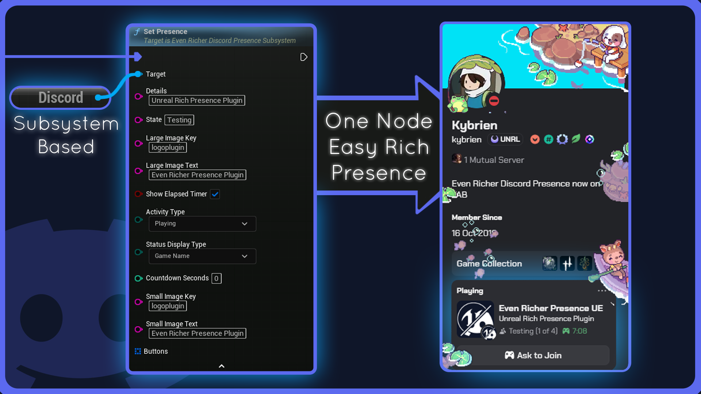
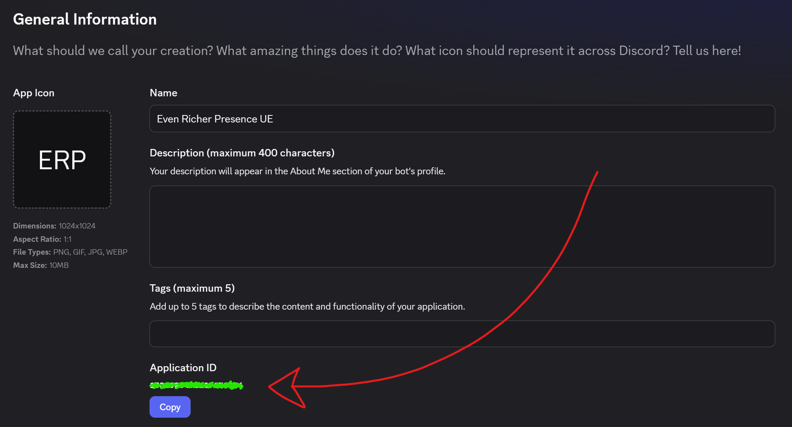
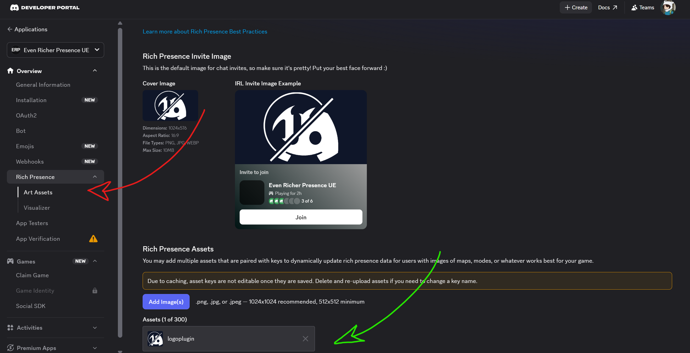
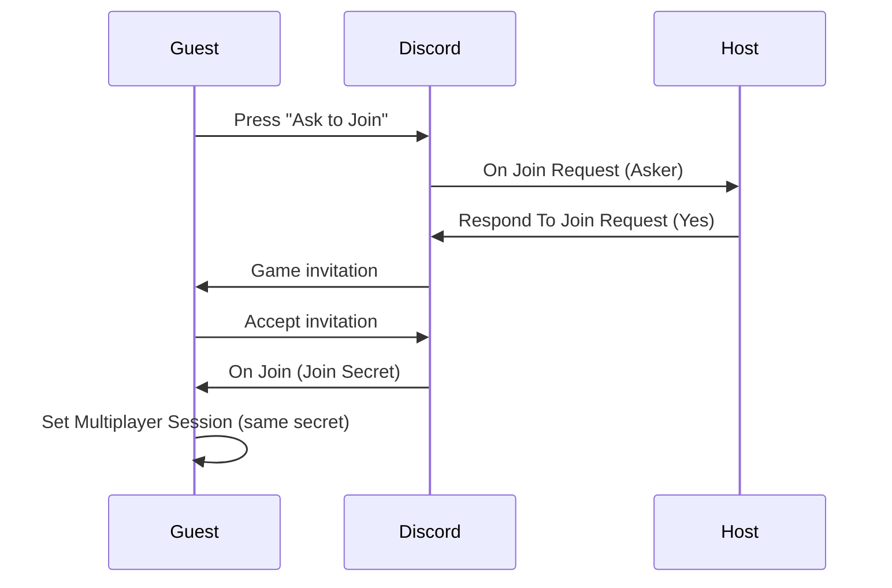

<div align="center">

<!-- PLACEHOLDER: drop your logo here, 200px wide looks best -->


# Even Richer Discord Presence

**The complete Discord Rich Presence plugin for Unreal Engine.**
*Zero dependencies. Full C++ source. Blueprint first.*

[]()
[](https://www.fab.com/sellers/Kybrien)
[](https://discord.gg/BwhyxQAAUn)

**English** · [Documentation en français](README.fr.md)

[Setup](#-setup) · [Quick start](#-quick-start) · [Node reference](#-node-reference) · [Recipes](#-recipes) · [Troubleshooting](#-troubleshooting)

</div>

---

<!-- PLACEHOLDER: hero screenshot, a real Discord profile showing a full presence card -->


## Why this plugin

|  | Even Richer Discord Presence | Free alternatives |
|---|:---:|:---:|
| **No bundled DLL** | Yes | No, ships `discord-rpc` |
| **Actively maintained** | Yes | Abandoned |
| **Profile buttons** | Yes | No |
| **Activity types** | Yes | No |
| **Countdown & progress bar** | Yes | No |
| **Actionable diagnostics** | Yes | No |
| **Full C++ source** | Yes | Varies |

> The free options wrap `discord-rpc`, a library **Discord itself abandoned**, and ship a precompiled
> DLL inside your game. This plugin speaks the Discord IPC protocol directly in engine native C++.

---

## 📦 Setup

### 1. Install

Copy the `EvenRicherDiscordPresence` folder into your project's `Plugins/` folder, then relaunch the
editor and accept the compile prompt.

Check **Edit → Plugins** that *Even Richer Discord Presence* is enabled.

### 2. Create your Discord application

> [!IMPORTANT]
> **The application name is what players see.** Name it `Test` and Discord shows *"Playing Test"*.
> Use your commercial game name from the start.

1. Go to the [Discord Developer Portal](https://discord.com/developers/applications) → **New Application**
2. Open **General Information** and copy the **Application ID**

<!-- PLACEHOLDER: screenshot of the Developer Portal with the Application ID highlighted -->


### 3. Upload your artwork

> [!WARNING]
> Images **must** go under **Rich Presence → Art Assets**, *not* under **Cover Image**.
> Cover Image has no name, so it can never be used as an image key. This is the single most common
> setup mistake.

1. In your application, open **Rich Presence → Art Assets**
2. Click **Add Image(s)** and upload your artwork
3. The **name** you give each asset is what goes into `Large Image Key`

<!-- PLACEHOLDER: screenshot of the Art Assets tab with an asset name highlighted -->


**Sizing:** square, 512x512 minimum. The large image renders square, so a 16:9 image gets cropped.

**Propagation:** allow up to 10 minutes, then press `Ctrl+R` in Discord. Image keys also accept a
direct `https://` URL, which works instantly and is handy for testing.

### 4. Configure the plugin

**Edit → Project Settings → Plugins → Even Richer Discord Presence**

| Setting | Default | Purpose |
|---|:---:|---|
| **Client Id** | *empty* | Your Discord Application ID. **Required.** |
| **Auto Connect On Startup** | ✅ | Connects on game start. When off, the connection opens on the first presence call. |
| **Auto Subscribe To Activity Events** | ✅ | Subscribes to Join and Ask to Join automatically. |

<!-- PLACEHOLDER: screenshot of the Project Settings panel -->


### 5. Enable activity display in Discord

> [!CAUTION]
> In the **Discord client**, not the portal:
> **User Settings → Activity Privacy → Display current activity as a status message** must be **ON**.
>
> This is a *per player* setting. No code can override it, and it is the number one cause of
> *"nothing shows up"*.

---

## 🚀 Quick start

Put this in your **Game Instance Blueprint**. It survives level changes, so the presence does not drop
while a level loads.

```
Event Init
  └─ Discord ──► Set Presence
                   Details            : "Ashfall Ridge"
                   State              : "Exploring"
                   Large Image Key    : "cover"
                   Large Image Text   : "Ashfall Ridge"
                   Show Elapsed Timer : ✔
```

Type **`discord`** in the Blueprint search to find the compact **Discord** node, then drag from its
output to reach everything else.

**That is the whole integration.** No Game Instance wiring, no cast, no tick, no manual callback pump.

<!-- PLACEHOLDER: screenshot of this exact Blueprint graph -->


**Result:**

```
Playing YourAppName
Ashfall Ridge          ← Details
Exploring              ← State
02:14 elapsed          ← Show Elapsed Timer
[image]                ← Large Image Key
```

---

## 🧩 Node reference

**20 Blueprint nodes, 6 events.** Every one carries a tooltip in the editor.

### Entry point

| Node | Description |
|---|---|
| **Discord** *(Get Discord Presence)* | Pure compact node. The single entry point, drag from it to reach everything. |

<br/>

### Presence

<table>
<tr><th>Node</th><th>What it does</th></tr>
<tr><td><b>Set Presence</b></td><td>The main node. Sets what appears on the profile.</td></tr>
<tr><td><b>Restart Elapsed Timer</b></td><td>Resets the counting up timer to zero and pushes immediately.</td></tr>
<tr><td><b>Clear Presence</b></td><td>Removes the presence without closing the connection.</td></tr>
<tr><td><b>Set Advanced Presence</b></td><td>Takes the full <code>Discord Activity</code> struct.</td></tr>
</table>

<details>
<summary><b>▸ Set Presence, all 11 pins</b></summary>

<br/>

| Pin | Type | Shown by default | Purpose |
|---|---|:---:|---|
| `Details` | String | ✅ | First line. The level, mode or match. |
| `State` | String | ✅ | Second line. What the player is doing now. |
| `Large Image Key` | String | ✅ | Art asset name, or an `https://` URL. |
| `Large Image Text` | String | ✅ | Tooltip when hovering the large image. |
| `Show Elapsed Timer` | Bool | ✅ | Counting up timer. |
| `Activity Type` | Enum | *folded* | Playing / Listening to / Watching / Competing in. |
| `Status Display Type` | Enum | *folded* | Which line shows in the member list. |
| `Countdown Seconds` | Int | *folded* | Counting down timer. `0` disables it. |
| `Small Image Key` | String | *folded* | Corner image. |
| `Small Image Text` | String | *folded* | Tooltip for the small image. |
| `Buttons` | Array | *folded* | Up to 2 clickable profile buttons. |

*Folded pins live behind the small arrow at the bottom of the node. Folded means hidden on this node,
**not** "only available on Set Advanced Presence".*

</details>

<details>
<summary><b>▸ Timers, three modes</b></summary>

<br/>

The two timer pins are independent, and it is the **combination** that unlocks the interesting one.

| `Show Elapsed Timer` | `Countdown Seconds` | Discord shows |
|:---:|:---:|---|
| ✅ | `0` | A timer counting **up**. The session length look. |
| ❌ | `60` | A timer counting **down** to zero. |
| ✅ | `60` | A **progress bar** with elapsed and remaining, like a music player. |

`Countdown Seconds` only restarts when the requested value *changes*, so calling `Set Presence` every
frame with the same duration keeps a stable deadline.

> [!NOTE]
> **A finished countdown does not disappear.** Once the deadline passes, Discord flips the display and
> counts **up** from it. A round timer that hits zero silently becomes an overtime counter. Push a new
> value or set it back to `0`.

</details>

<details>
<summary><b>▸ Set Advanced Presence, and when to use it</b></summary>

<br/>

It is **not** "Set Presence with more options unlocked". Exactly four fields are reachable only here:

| Field | Why it is not on Set Presence |
|---|---|
| `Start Timestamp` | `Show Elapsed Timer` already does this correctly. |
| `End Timestamp` | `Countdown Seconds` already does this correctly. |
| `Details Url` | Niche, would add a pin most projects never touch. |
| `State Url` | Same, and it only renders without a party. |

The other reason to use it: the struct is **storable**. Presence presets can live in a Data Table and
be passed between functions, which is the only data driven path in the plugin.

Party ID derivation, session preservation and every diagnostic apply here exactly as they do on
`Set Presence`.

</details>

<br/>

### Multiplayer

<table>
<tr><th>Node</th><th>What it does</th></tr>
<tr><td><b>Set Multiplayer Session</b></td><td>Makes the session joinable. Merges into the presence already set.</td></tr>
<tr><td><b>Clear Multiplayer Session</b></td><td>Removes the party and secret. The only way to end a session.</td></tr>
<tr><td><b>Respond To Join Request</b></td><td>Answers an Ask to Join with Yes, No or Ignore.</td></tr>
<tr><td><b>Subscribe To Activity Event</b> <i>(advanced)</i></td><td>Manual subscription. Only needed if Auto Subscribe is off.</td></tr>
<tr><td><b>Unsubscribe From Activity Event</b> <i>(advanced)</i></td><td>The reverse.</td></tr>
<tr><td><b>Is Subscribed To Activity Event</b> <i>(advanced)</i></td><td>Returns a bool.</td></tr>
</table>

<details>
<summary><b>▸ Set Multiplayer Session, all 5 pins</b></summary>

<br/>

| Pin | Type | Shown by default | Purpose |
|---|---|:---:|---|
| `Join Secret` | String | ✅ | The token Discord hands back through `On Join`. Puts **Ask to Join** on the profile. |
| `Party Size` | Int | ✅ | Current player count. |
| `Party Max` | Int | ✅ | Party capacity. |
| `Party Id` | String | *folded* | Leave empty, it is derived from the join secret. Required by Discord for any party to show. |

</details>

<br/>

### Connection

| Node | Returns | What it does |
|---|:---:|---|
| **Connect** | | Connects with a given Client ID. Only needed to override the settings ID or control timing. |
| **Disconnect** | | Closes the connection and clears the presence. |
| **Is Connected** | `Bool` | True once the handshake has completed. |
| **Get Connection State** | `Enum` | `Disconnected` / `Connecting` / `Connected`. |
| **Get Local User** | `Struct` | The Discord account signed in on this machine. Cached for the whole session. |

<br/>

### Helpers

| Node | Returns | What it does |
|---|:---:|---|
| **Now** *(Discord Time Now)* | `Int64` | Current Unix timestamp. Feed to `Start Timestamp`. |
| **Discord Time From Now** | `Int64` | A future Unix timestamp. Feed to `End Timestamp`. |
| **Button** *(Discord Button)* | `Struct` | Builds one profile button from a label and a URL. |
| **Get Discord Avatar URL** | `String` | A direct image URL, ready for a UMG brush. |

*`Get Discord Avatar URL` handles animated avatars (`.gif`), rounds the size to the nearest power of
two (16 to 4096), and falls back to the default avatar.*

---

## 📡 Events

**All six fire on the game thread**, so actors, widgets and game state can be touched directly.

| Event | Payload | Fires when |
|---|---|---|
| **On Ready** | `Local User` | Handshake complete. |
| **On Connection Error** | `Code`, `Message` | Discord refused or is unreachable. |
| **On Disconnected** | | Connection lost or closed. |
| **On Connection State Changed** | `New State` | Any state transition. |
| **On Join** | `Join Secret` | The player accepted an invite. |
| **On Join Request** | `Asker` | Someone pressed Ask to Join. |

> [!IMPORTANT]
> **`On Ready` can fire before your Blueprint binds to it.** The connection starts as soon as the
> subsystem initialises and the handshake returns on a worker thread. Bind **and** check the current
> state in the same place:
>
> ```
> Discord ──► Bind Event to On Ready ──► HandleReady
> Discord ──► Is Connected ─► Branch ─► True ──► HandleReady
> ```
>
> This is why it looks intermittent: a cold pipe is slow enough that you win the race, a warm one is
> not.

*These six are the complete set. Discord itself only emits two inbound Rich Presence events, join and
join request, so there is no leave event, no party update and no member list.*

---

## 🧱 Structs and enums

<details>
<summary><b>▸ Discord Activity</b></summary>

<br/>

| Field | Reachable from |
|---|---|
| `Activity Type` | Set Presence |
| `Status Display Type` | Set Presence |
| `State` / `Details` | Set Presence |
| `Details Url` / `State Url` | Set Advanced Presence only |
| `Start Timestamp` / `End Timestamp` | Set Advanced Presence only |
| `Large Image Key` / `Text` | Set Presence |
| `Small Image Key` / `Text` | Set Presence |
| `Party Id` / `Size` / `Max` | Set Multiplayer Session |
| `Buttons` | Set Presence |
| `Join Secret` | Set Multiplayer Session |

*Two protocol fields, `Match Secret` and `Instance`, exist in the struct but are **not exposed to
Blueprint**. They drove the old "Notify me" button Discord no longer shows. They remain serialized and
settable from C++ for full protocol parity.*

</details>

<details>
<summary><b>▸ Discord Activity Type</b></summary>

<br/>

| Value | Reads as | Fits |
|---|---|---|
| **Playing** *(default)* | Playing *YourGame* | Almost every game |
| **Listening to** | Listening to *YourGame* | Music, audio *(no party, no joining)* |
| **Watching** | Watching *YourGame* | Video, replays *(no party, no joining)* |
| **Competing in** | Competing in *YourGame* | Ranked, tournaments *(no party, no joining)* |

> [!WARNING]
> **The whole multiplayer side requires `Playing`.** Discord accepts a join secret and a party on any
> type and echoes them straight back, but it renders neither the party count nor the Ask to Join
> button unless the type is Playing. Profile buttons are unaffected and render on all four types.

*Discord only accepts these four through Rich Presence. Streaming and Custom are refused by the
Discord client itself, so they are deliberately absent rather than offered and silently dropped.*

</details>

<details>
<summary><b>▸ Discord Status Display Type</b></summary>

<br/>

Picks which single line Discord uses for the **one line status next to a player's name**, in a
server's member list and in the friends list.

| Value | The member list shows |
|---|---|
| **Game Name** *(default)* | `Playing YourGame` |
| **State Line** | your `State` text |
| **Details Line** | your `Details` text |

> [!NOTE]
> **It does not change the profile card.** The card always shows every line you set. Switching this
> while looking at a profile shows no difference at all, which makes it easy to think it is broken.
> Watch a server member list instead, ideally from a second account.

</details>

<details>
<summary><b>▸ Other types</b></summary>

<br/>

- **Discord Activity Button:** `Label`, `Url`. Maximum 2 per activity.
- **Discord User** *(read only)*: `User Id`, `Username`, `Global Name`, `Avatar`.
- **Discord Connection State:** `Disconnected` / `Connecting` / `Connected`.
- **Discord Join Reply:** `No` / `Yes` / `Ignore`.

</details>

---

## 🎮 Multiplayer guide

### The two button slots

A Discord presence card has room for **exactly two buttons**, and there are two completely different
ways to fill them. Discord will not mix them.

<table>
<tr>
<td width="50%" valign="top">

**Way 1: profile buttons**
*You define them*

Filled through the `Buttons` pin. External links, a click opens a browser and nothing comes back to
your game.

```
Button "Join our Discord"  https://discord.gg/xxx
Button "Wishlist on Steam" https://store.steam...
```

Typical for a single player or marketing presence.

</td>
<td width="50%" valign="top">

**Way 2: session buttons**
*Discord generates them*

You never name these. **Ask to Join** appears because a `Join Secret` exists.

Interactive: a click starts a round trip with your game and the secret comes back so you can connect
the player.

This is the only path that produces gameplay.

</td>
</tr>
</table>

> [!CAUTION]
> **For a multiplayer game, leave the `Buttons` pin empty.** A single stray connection into that pin
> silently costs you joinability on every text refresh. It is the most common way to break a working
> join flow while everything else looks correct.

**Two things that look like bugs and are not:**

- **You will never see these buttons on your own profile.** Discord renders them for other people only.
- **A full party does not necessarily hide Ask to Join.** Enforce capacity in your own game.

### The full join chain



> [!IMPORTANT]
> **Discord manages no membership at all.** Accepting an invite launches the game and delivers the
> secret to `On Join`. It does **not** add anyone to a party and never modifies the joining player's
> presence.
>
> Grouping happens only because two clients independently publish the **same join secret** and
> therefore derive the same party ID. If the joining player's game never calls
> `Set Multiplayer Session`, they show the game with no group, which looks broken and is not.

### Keeping the party count honest

`Party Size` is a value **your game publishes**, not a counter Discord maintains.

Every machine already in the session has to republish when the count changes. If a second player joins
and only the newcomer publishes `Party Size 2`, the host stays at `1 of 4` while two people are
playing.

```
When a player leaves
  │
  ├─ On the remaining clients  ──► Set Multiplayer Session with the new Party Size
  └─ On the client leaving     ──► Clear Multiplayer Session
```

---

## 🍳 Recipes

<details>
<summary><b>▸ Make a match joinable</b></summary>

<br/>

```
Custom Event: OnMatchStarted
  │
  ├─ Discord ──► Set Presence
  │      Details : "Ranked, Dust Basin"
  │      State   : "In match"
  │
  └─ Discord ──► Set Multiplayer Session
         Join Secret : <your session code>
         Party Size  : 2
         Party Max   : 4
```

**What goes in Join Secret?** An opaque token Discord never reads and hands back untouched:

| Your setup | Join Secret |
|---|---|
| Listen server | the connect address, e.g. `192.168.1.20:7777` |
| Steam / EOS | the session ID |
| Custom lobby | your lobby code |

For a first test, a hardcoded string works fine.

</details>

<details>
<summary><b>▸ Handle someone joining</b></summary>

<br/>

```
HandleJoin (Join Secret)
  │
  ├─ Get Player Controller (0)
  │    └─► Execute Console Command : "open " + Join Secret
  │
  └─ Discord ──► Set Multiplayer Session
                    Join Secret : <the secret just received>
                    Party Size  : 2
                    Party Max   : 4
```

The second call is the one everyone forgets. Without it, the joining player shows the game with no
group.

</details>

<details>
<summary><b>▸ Ask to Join popup</b></summary>

<br/>

```
HandleJoinRequest (Asker)
  │
  ├─ Break Discord User
  │    ├─ Global Name ──► popup text
  │    └─ Discord ──► Get Discord Avatar URL (Asker, 128)
  │                     └─► Download Image ──► popup icon
  │
  ├─ "Accept"  ──► Discord ──► Respond To Join Request (Asker, Yes)
  └─ "Decline" ──► Discord ──► Respond To Join Request (Asker, No)
```

> [!NOTE]
> **Always answer.** The request expires after roughly 30 seconds. If the player closes the popup,
> respond `Ignore`. Note that `No` and `Ignore` look identical to the asker: Discord never tells them
> they were refused.

</details>

<details>
<summary><b>▸ Music player progress bar</b></summary>

<br/>

```
Discord ──► Set Presence
     Details            : "Neon Skyline"
     State              : "Kavinsky"
     Show Elapsed Timer : ✔
     Countdown Seconds  : 214          (track length in seconds)
     Activity Type      : Listening to
```

Both timers together give the elapsed and remaining bar. Paired with `Listening to`, the card reads
exactly like a music player.

</details>

<details>
<summary><b>▸ Two profile buttons</b></summary>

<br/>

```
Make Array
  ├─ Button  Label "Join our Discord"  Url "https://discord.gg/xxxxx"
  └─ Button  Label "Wishlist on Steam" Url "https://store.steampowered.com/app/xxxxx"
        └─► Set Presence ▸ Buttons
```

</details>

<details>
<summary><b>▸ Connection state widget</b></summary>

<br/>

```
Event Construct
  ├─ Discord ──► Bind Event to On Connection State Changed ──► Update Icon
  └─ Discord ──► Get Connection State ──► Update Icon
```

Bind for what happens next, read the current value for what already happened. A widget built mid
session would otherwise show a stale icon until the next transition.

</details>

<details>
<summary><b>▸ Player name and avatar</b></summary>

<br/>

```
Discord ──► Get Local User ──► Break Discord User
     ├─ Global Name ──► Set Text
     └─► Get Discord Avatar URL ──► Download Image
```

</details>

---

## ⚙️ Behaviour you should know

**Calling presence functions while disconnected loses nothing.** The activity is stored and sent as
soon as the connection is ready. If nothing is connected at all, the connection opens on demand using
the Client ID from Project Settings. No `Is Connected` guard needed.

> *Corollary: `Disconnect` followed by `Set Presence` reconnects.*

**Safe to call every frame.** Updates coalesce, only the most recent is sent, spaced internally.

**The elapsed timer does not reset** when you call `Set Presence` again to refresh text.

**An active joinable session is preserved** across `Set Presence` calls, unless you pass buttons.

**Automatic reconnection.** If Discord is not running or restarts mid game, the worker reconnects on
its own (backoff 1, 2, 4, 8, 16, 30 seconds, 10 attempts) and **re-pushes the last presence**, so the
profile does not blank. Subscriptions self heal too.

**Timestamps are absolute, not durations.** `Start Timestamp` and `End Timestamp` on
`Set Advanced Presence` are absolute Unix timestamps in **seconds**. Passing `60` means "sixty seconds
after 1970". Use the **Now** and **Discord Time From Now** helpers.

**Play In Editor:** each PIE session gets its own game instance and therefore its own connection. Test
presence with a **single** PIE client.

**Dedicated servers and commandlets:** the subsystem is created but does not connect. Intended.

---

## 🔧 Troubleshooting

<details open>
<summary><b>▸ Most common issues</b></summary>

<br/>

| Symptom | Cause |
|---|---|
| **Nothing appears on the profile** | *Activity Privacy → Display current activity* is off in the Discord client. Per player setting, no code can override it. |
| **Grey square with a `?` instead of the image** | The image was uploaded as **Cover Image**, not under **Rich Presence → Art Assets**. Only Art Assets have a usable name. |
| **Image missing and no hover text either** | Same cause. `Large Image Text` is a tooltip attached to the image, with no image resolved there is nothing to hover. |
| **No Ask to Join button** | `Activity Type` is not `Playing`. Or: missing join secret, missing party size/max, or the presence also carries profile buttons. Also, Discord never shows it on your own profile. |

</details>

<details>
<summary><b>▸ Connection issues</b></summary>

<br/>

| Symptom | Cause |
|---|---|
| Stuck on `Connecting` | Discord is not running, or the Client ID is not a valid Application ID. |
| Nothing sends and no log at all | No Client ID in Project Settings. A single warning is logged on the first call. |
| `On Connection Error` code `4000` | Discord rejected the payload. The log carries Discord's exact message. |
| `On Ready` sometimes fires, sometimes not | You bound after the handshake completed. Bind **and** check `Is Connected`. |
| Works in editor, not packaged | The Client ID did not ship in `DefaultGame.ini`. |

</details>

<details>
<summary><b>▸ Multiplayer issues</b></summary>

<br/>

| Symptom | Cause |
|---|---|
| No group shown at all, even on the host | `Activity Type` is not `Playing`. Discord renders the party count only for Playing. |
| Joining player shows the game but no group | Their game never published a session. Call `Set Multiplayer Session` inside `On Join`. |
| Host still shows `1 of 4` with two players | `Party Size` is published by your game, not counted by Discord. Republish on every client. |
| `On Join` never fires | The joining player's game is not subscribed, or the secret was empty when the invite was created. |
| Party not shown despite Party Size / Max | Discord ignores a party with no ID. Set `Party Id`, or give a `Join Secret`. |

</details>

<details>
<summary><b>▸ Display oddities</b></summary>

<br/>

| Symptom | Cause |
|---|---|
| Elapsed timer shows `496201:20:41` | A duration was passed to `Start Timestamp`. Plug in the **Now** node. |
| Countdown stuck at `0` | Same cause on `End Timestamp`. Plug in **Discord Time From Now**. |
| `Status Display Type` seems to do nothing | You are looking at the profile card. This only changes the one line status in a member list. |
| `State Url` does nothing, no hover, no click | A party is published. Discord merges the party count into the State line and will not link a composite line. |
| Profile buttons disappeared | You made the session joinable. Buttons and secrets are mutually exclusive. |

</details>

### Verbose logging

Add to `Config/DefaultEngine.ini`:

```ini
[Core.Log]
LogEvenRicherDiscordPresence=Verbose
```

Every frame is logged in both directions with its full JSON payload, prefixed `-->` for outgoing and
`<--` for incoming, plus every diagnostic warning.

---

## 📋 Scope

**This plugin does signalling, not networking.**

| The plugin does | Your game does |
|---|---|
| Tell Discord a session exists | Create the session |
| Show the Ask to Join button | Make it reachable on the network |
| Carry an opaque string between clients | Actually connect the player |
| Report who wants to join | Handle the travel |

`On Join` hands you a string. What happens next is your game's session system: listen server, Steam,
EOS. This is not a limitation of this plugin, it is how Discord Rich Presence works.

**Also out of scope:**

- **Mac and Linux.** Windows only in this version.
- **No leave event.** Discord provides two inbound events, join and join request, and nothing else.
- **No Spectate.** Discord removed spectating from its clients entirely.
- **Discord's Social SDK** features: friends list, lobbies, voice, direct messages.

---

## 💬 Support

<div align="center">

**Found a bug? Need a feature? Have a question?**

[](https://discord.gg/BwhyxQAAUn)
[](https://www.fab.com/sellers/Kybrien)

*Built by Kybrien, the developer of Twitch StreamSync.*

</div>

---

<div align="center">
<sub>

**EVEN RICHER DISCORD PRESENCE IS AN INDEPENDENT UNREAL ENGINE PLUGIN AND IS NOT AFFILIATED WITH,**

**ENDORSED BY, OR SPONSORED BY DISCORD INC. ALL DISCORD TRADEMARKS, LOGOS AND BRAND NAMES ARE THE**

**PROPERTY OF THEIR RESPECTIVE OWNERS.**

Copyright 2026 Kybrien. All Rights Reserved.

</sub>
</div>
